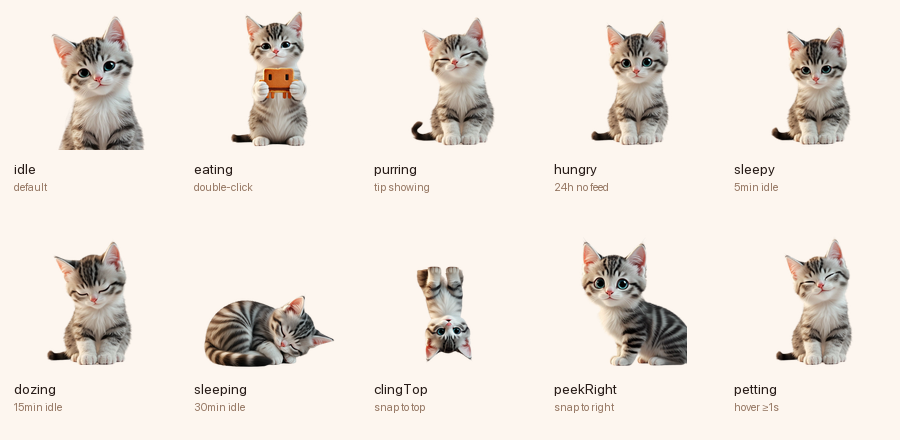

# mypet 🐱

> A fluffy desktop cat that eats your Claude Code tokens.
>
> Move your mouse near the cat — a wobbly little Claude-cookie follows your cursor. **Double-click**
> the cat to feed it. It chomps one `claude -p` call and bubbles back a Claude
> Code tip, a prompt to try, a 打油诗 (Chinese quatrain), or a tech-news headline.
> Then goes back to sleep.

[](https://github.com/anzy-renlab-ai/mypet/actions/workflows/ci.yml)
[](https://www.apple.com/macos)
[](https://developer.apple.com/swiftui)
[](LICENSE)
[](Tests)
[](https://mypet.renlab.ai)
[](https://ko-fi.com/alvinanziyan)

<p align="center">
  
</p>

<p align="center">
  <strong>👉 <a href="https://mypet.renlab.ai">mypet.renlab.ai</a></strong>
</p>

## Why

You pay for Claude Code anyway. The little cat spends *your* subscription
quota — no separate Anthropic API key, no server, no telemetry. When you're
not feeding it, it costs **zero CPU** and **zero network**. When you do feed
it, you get one cute interruption and one tiny morsel of useful information.

It's a screensaver that pays rent.

## How it works

```
 mouse near + double-click  ─►  chomp animation  ─►  claude -p "<prompt>"  ─►  💬 tip bubble
                                                                                    │
                                           click bubble copies tip + dismisses  ◄──┘
```

1. Move mouse close to the cat — a wobbly little cookie follows your cursor.
2. **Double-click** the cat to trigger a feed.
3. Cat plays a chomp animation; lightning + fish particles fly up; halo glows.
4. `mypet` shells out to your local `claude` CLI — same login, same quota.
5. The reply appears in a tiny speech bubble (with theme badge + token count).
6. Click the bubble to copy the tip; it auto-dismisses after a few seconds.

Cooldown: one feed per minute (the cat tells you when it's still digesting).
No interaction for 24h → the cat gets hungry (a sad face + a tear). All
visual — still zero background work.

## States

<p align="center">
  
</p>

Each state plays its own bundled APNG (3D Pixar-style kitten, generated via
Kling and cleaned through BiRefNet). The Mac app overlays subtle procedural
micro-motion only when it adds something — most of the time the APNG carries
the entire performance.

### Feedback cycle (user-triggered)
| State | When | Looks like |
|---|---|---|
| `idle` | default | sitting, slow breath + tail-tip twitch |
| `eating` | feeding | nibbling a Claude-cookie held in both paws |
| `excited` | feed succeeded | sparkly eyes, tail vibrating high |
| `purring` | tip showing | eyes closed in crescent smile, head tilted |

### Sleep progression (passive — silent, never grabs attention)
| State | When | Looks like |
|---|---|---|
| `sleepy` | 5min idle | heavy eyelids, slow blink, one droop-and-recover |
| `dozing` | 15min idle | sitting upright, head dropped to chest, eyes closed |
| `sleeping` | 30min idle | curled into a fluffy ball on its side, deep breath |

### Mood / engagement
| State | When | Looks like |
|---|---|---|
| `hungry` | 24h no feed | quiet sad sit, glistening eyes, no demand |
| `petting` | hover ≥1s on cat | head leans into invisible hand, eyes squint happy |

### Spatial (drag the window to a screen edge)
| State | When | Looks like |
|---|---|---|
| `clingTop` | window near top | kitten hangs upside-down by both front paws |
| `peekRight` | window near right edge | half body peeks out from the right, looking back curiously |
| `peekLeft` | window near left edge | mirrored peekRight |

### Personality moments (rare, idle-only, gated to recent activity)
| State | When | Looks like |
|---|---|---|
| `licking` | rare ambient | kitten licks its right paw (~5 slow licks) |
| `washing` | rare ambient | kitten wipes face with the licked paw |

## Tip themes

Every feed picks one of six themes (weighted toward the Claude Code niche)
so you don't get the same vibe twice in a row:

| Badge | Theme | Weight | What you get |
|---|---|---|---|
| ☕ | `claudeTip` | 30% | Non-obvious Claude Code tip |
| 💡 | `promptIdea` | 20% | A specific prompt to type into Claude Code now |
| 📰 | `techNews` | 18% | One-line tech-news headline |
| 🤓 | `til` | 14% | "Today I learned" fact a senior eng would still find surprising |
| 😆 | `devJoke` | 10% | Programmer one-liner |
| 🥟 | `dayouShi` | 8% | 程序员打油诗 (Chinese punny quatrain) |

Click the bubble to copy the tip to your clipboard. The menubar 🐾 dropdown
keeps the last 10 tips under **Recent tips** — click any to copy.

## Requirements

- macOS 13 or later
- [Claude Code CLI](https://docs.anthropic.com/claude-code) on your `PATH`
  (`claude --version` works)

## Install

### Option A — pre-built `.app` (no toolchain needed)

1. Grab the latest `mypet-x.y.z-macos.zip` from
   [**Releases**](https://github.com/anzy-renlab-ai/mypet/releases/latest).
2. Unzip → drag `mypet.app` to `/Applications`.
3. **First launch only:** macOS Gatekeeper will say *"developer cannot be
   verified"* because the app is ad-hoc signed (no Apple Developer ID).
   Right-click `mypet.app` → **Open** → **Open** in the dialog. Or:
   ```bash
   xattr -d com.apple.quarantine /Applications/mypet.app
   ```
4. Look for the 🐾 paw in your menubar.

### Option B — build from source

```bash
git clone https://github.com/anzy-renlab-ai/mypet
cd mypet
swift run mypet
```

### After install

First launch shows a tiny onboarding wizard (detects `claude`, asks about
launch-at-login, plays a demo feed).

The cat sits in the bottom-right of your **primary** display. The menubar
🐾 gives you `Feed now`, `Recent tips`, `Bring cat to this screen`,
`Snap to edge`, `Launch at login`, and `Quit`.

## Tests

```bash
swift test
```

95 tests cover the `claude` subprocess wrapper (binary discovery, timeout,
cancellation, output normalization including multi-line tips, error
classification, concurrency guard, FD-leak check, JSON envelope parsing for
token capture), the feed log (corruption recovery, cooldown, hungry
detection, max-entries cap), the pet state machine, the feed coordinator
(theme rotation + locale-aware prompts + token reporting), and the window
configuration (snap-to-edge, expanded/compact sizes).

## Layout

```
Sources/MyPet/
  App/        MyPetApp, AppDelegate, MenubarController
  Window/     PetWindow (borderless, transparent, status-bar level, draggable)
  Scene/      TurtleView + CuteCatFace (all-vector cat, no SF Symbol)
  UI/         OnboardingView, TipBubble, FeedButton
  Domain/     ClaudeSubprocess, FeedCoordinator, PetState, LoginItem
  Storage/    FeedLog (JSON in Application Support)
```

See [CLAUDE.md](CLAUDE.md) for the architecture cheat-sheet and invariants
that exist to keep mypet stable + cheap (zero-CPU-when-idle, hover-via-Task,
single-in-flight feed, etc.).

## License

Dual-tracked:

- **Source code** ([LICENSE](LICENSE)) — MIT. Fork it, ship it, sell it.
- **Cat artwork & audio** ([Sources/MyPet/Resources/sprites/LICENSE](Sources/MyPet/Resources/sprites/LICENSE))
  — All Rights Reserved. The fluffy kitten is © alvin. Personal use of
  mypet is fine; re-packaging the cat in another product / training AI on
  the sprites / commercial redistribution requires written permission.

See [NOTICE.md](NOTICE.md) for the full attribution.

PRs welcome on the code — especially new tip prompts. Skin contributions
welcome but submitted skins are dual-licensed (code MIT, artwork CC-BY-NC
by default unless you specify otherwise).
