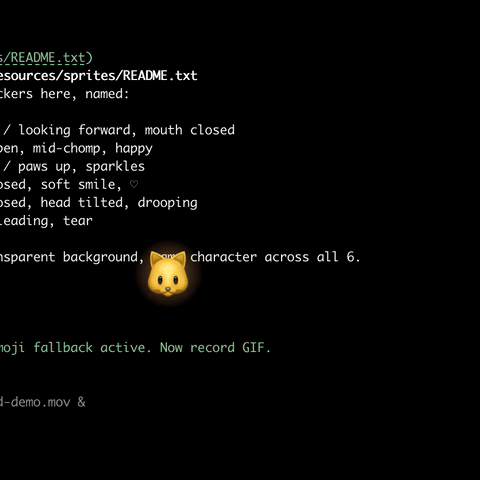

# mypet 🐱

> A fluffy desktop cat that eats your Claude Code tokens.
>
> Hover for one second. The cat chomps one `claude -p` call and bubbles back
> a Claude Code tip, a prompt to try, a haiku, or a tech-news headline.
> Then goes back to sleep.

[](https://github.com/anzy-renlab-ai/mypet/actions/workflows/ci.yml)
[](https://www.apple.com/macos)
[](https://developer.apple.com/swiftui)
[](LICENSE)
[](Tests)

<p align="center">
  
</p>

## Why

You pay for Claude Code anyway. The little cat spends *your* subscription
quota — no separate Anthropic API key, no server, no telemetry. When you're
not feeding it, it costs **zero CPU** and **zero network**. When you do feed
it, you get one cute interruption and one tiny morsel of useful information.

It's a screensaver that pays rent.

## How it works

```
 hover 1s   ─►  chomp animation  ─►  claude -p "<prompt>"  ─►  💬 tip bubble
                                                                    │
   ◄─ purr ──────────── 8s ──────── click to dismiss / auto-fade ◄──┘
```

1. Mouse over the cat for ~1 second (a small dot ring fills up).
2. Cat plays a chomp animation, ears twitch, sparkles fly.
3. `mypet` shells out to your local `claude` CLI — same login, same quota.
4. The reply appears in a tiny speech bubble above the cat.
5. Cat purrs, then drifts back to idle.

Cooldown: one feed per minute (the cat tells you when it's still digesting).
No interaction for 24h → the cat gets hungry (a sad face + a tear). All
visual — still zero background work.

## States

| State | When | Looks like |
|---|---|---|
| `idle` | resting | 🐱 gentle sway, slow blink |
| `eating` | feeding now | 😺 mouth open, ⚡ + 🐟 sparkles |
| `excited` | feed succeeded | 😸 jump, ✦ stars overhead |
| `purring` | tip showing | 😻 heart eyes, ♡ overhead |
| `sleepy` | 2h idle | 😽 closed eyes, head tilt, `zZz` |
| `hungry` | 24h no feed / error | 😿 frown, single tear |

## Tip themes

Every feed picks one of six themes (weighted toward the Claude Code niche)
so you don't get the same vibe twice in a row:

| Badge | Theme | Weight | What you get |
|---|---|---|---|
| ☕ | `claudeTip` | 30% | Non-obvious Claude Code tip |
| 💡 | `promptIdea` | 20% | A specific prompt to type into Claude Code now |
| 📰 | `techNews` | 18% | One-line tech-news headline |
| 🤓 | `til` | 14% | "Today I learned" fact a senior eng would still find surprising |
| 😆 | `devJoke` | 10% | Programmer one-liner |
| 🍂 | `haiku` | 8% | Programmer haiku (5/7/5) |

Click the bubble to copy the tip to your clipboard. The menubar 🐾 dropdown
keeps the last 10 tips under **Recent tips** — click any to copy.

## Requirements

- macOS 13 or later
- [Claude Code CLI](https://docs.anthropic.com/claude-code) on your `PATH`
  (`claude --version` works)

## Install + run

```bash
git clone https://github.com/<you>/mypet
cd mypet
swift run mypet
```

First launch shows a tiny onboarding wizard (detects `claude`, asks about
launch-at-login, then plays a demo feed).

The cat lives in the bottom-right of your primary display. Click-drag it
anywhere. The 🐾 menu-bar icon gives you `Feed now`, `开机自启`, and quit.

## Tests

```bash
swift test
```

81 tests cover the `claude` subprocess wrapper (binary discovery, timeout,
cancellation, output normalization, error classification, concurrency guard,
FD-leak check), the feed log (corruption recovery, cooldown, hungry detection),
the pet state machine, the feed coordinator, and the window configuration.

## Layout

```
Sources/MyPet/
  App/        MyPetApp, AppDelegate, MenubarController
  Window/     PetWindow (borderless, transparent, status-bar level, draggable)
  Scene/      TurtleView + CuteCatFace (all-vector cat, no SF Symbol)
  UI/         OnboardingView, TipBubble, FeedButton
  Domain/     ClaudeSubprocess, FeedCoordinator, PetState, LoginItem
  Storage/    FeedLog (JSON in Application Support)
```

See [CLAUDE.md](CLAUDE.md) for the architecture cheat-sheet and invariants
that exist to keep mypet stable + cheap (zero-CPU-when-idle, hover-via-Task,
single-in-flight feed, etc.).

## License

MIT. Built for Claude Code users who wanted something cute on their desktop.
PRs welcome — especially new tip prompts and seasonal cat skins.
